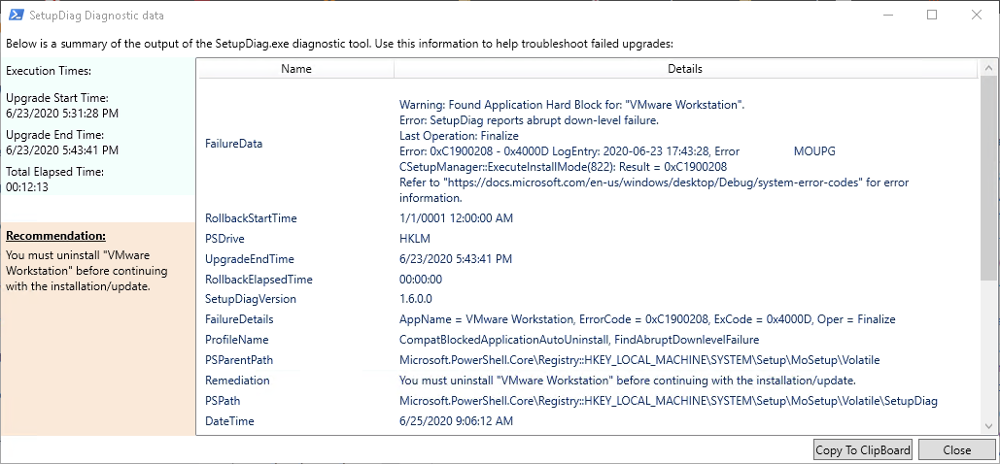

# About
Setupdiagui is a basic UI that gives you details on a setupdiag run after a failed Windows 10 feature update or IPU.

See blog post on using the UI here: https://wetterssource.com/setupdiag-ui

